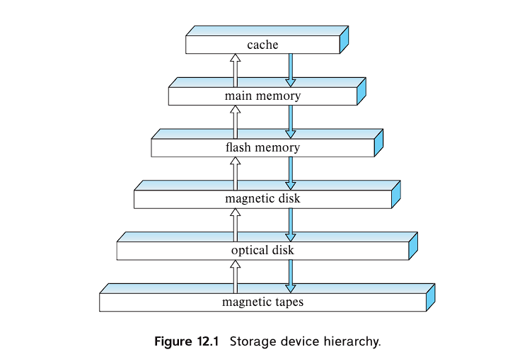
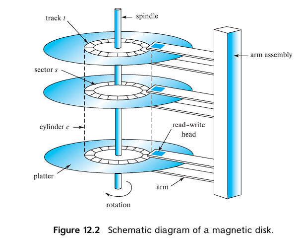

Database System Concepts Chatper 5: Storage & Indexing

# Chapter 12: Physical Storage Systems

## Overview 
Types of physical storages: 
- Cache
- Main Memory
    - on which general-purpose machine instructions operate
    - volatile
- Flash Memory
    - non-volatile
    - USB flash drives, solid-state drive (SSD)
    -  direct-access: read data from any location
- Magnetic-disk storage
    - hard disk drive (HDD)
    - data flow: disk -> (read into) -> memory -> (operate data) -> (write back into) -> disk
    -  direct-access
- Optical storage
    - digital video disk (DVD)
- Tape storage
    - sequential-access: alwasy access to data sequentially from the beginning of the tape 

Storage Hierachy:
- primary storage
    - cache, main memoery
- secondary storage (online storage)
    - flash memory, magnetic-disk storage 
- tertiary storage (offline storage)
    - magnetic tape, optical disk jukeboxes

## Magnetic Disks

Understand how does magnetic disk works
- platter, track, sector, cylinder
    - sector: minimun read-write unit
    - ith cylinder: ith tracks of all platters together
- read-write head, disk arm
- disk controller: 
    - interfaces between computer systerm and harware
    - checksum to each sector
    - remapping of bad sectors

Performance Measures
- Capacity
- Access time: time ellapsed from read-write request to data transfer starting time
    - Seek time: arm moves to locate track
    - rotational latency time: arm waits for disk rotation to locate sector
- Data transfer rate
    - the rate at which data can be retrieved from or stored to the disk
    - Disk block: logical unit of storage allocation and retrieval
- Reliability
    - mean time to failure (MTTF)

Disk data access time
- consists of overhead time, access time (seek + rotation) and data transfer time
- sequential access pattern:
    - block requests are for successive block numbers
    - only the first request requires a seek
    - minimal seek time, thus less disk data access time
- random access pattern:
    - block requests are for blocks randomly located on the disk
    - each request requires a seek
    - high seek time, thus more disk data access time

## Flash Memory

## RAID (Redundant arrays of independent disks)

Improvement of Reliability via Redundancy
- Mirroring (Shadowing):
    - to duplicate every disk, e.g. a logical disk then consists of two physical disks
    - higher mean time to data loss 
    - when writting data, write one copy first, then the next: to prevent data inconsistency

Improvement in Performance via Parallelism
- Disk Mirroring (2-disk mirroring):
    - same transfer rate
    - doubled number of reads per unit time
- Bit-Level Striping:
    - splitting the bits of each byte across multiple disks (e.g. an array of eight disks)
    - reading/writing data from all disks at the same time
    - same number of accesses per unit time
    - higher transfer rate (8 times as of single disk system)
    - not in practical use
- Block-Level Striping:
    - strips blocks across multiple disks (assume n disks)
    - logical block number i maps to: `floor(i/n)`th block on `(i % n) + 1`th disk
    - when reading large files, fetch n blocks at the same time in parallel from the n disks
    - higher transfer rate for large reads

RAID Levels

