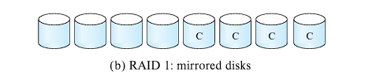

Database System Concepts Chatper 5: Storage & Indexing

# Chapter 12: Physical Storage Systems

## Overview 
Types of physical storages: 
- Cache
- Main Memory
    - on which general-purpose machine instructions operate
    - volatile
- Flash Memory
    - non-volatile
    - USB flash drives, solid-state drive (SSD)
    -  direct-access: read data from any location
- Magnetic-disk storage
    - hard disk drive (HDD)
    - data flow: disk -> (read into) -> memory -> (operate data) -> (write back into) -> disk
    - direct-access
- Optical storage
    - digital video disk (DVD)
- Tape storage
    - sequential-access: alwasy access to data sequentially from the beginning of the tape 

Storage Hierachy:
- primary storage
    - cache, main memoery
- secondary storage (online storage)
    - flash memory, magnetic-disk storage 
- tertiary storage (offline storage)
    - magnetic tape, optical disk jukeboxes

## Magnetic Disks

Understand how does magnetic disk work
- platter, track, sector, cylinder
    - sector: minimun read-write unit
    - ith cylinder: ith tracks of all platters together
- read-write head, disk arm
- disk controller: 
    - interfaces between computer systerm and hardware
    - checksum to each sector
    - remapping of bad sectors

Performance Measures
- Capacity
- Access time: time ellapsed from read-write request to data transfer starting time
    - Seek time: arm moves to locate track
    - rotational latency time: arm waits for platter rotation to locate sector
- Data transfer rate
    - the rate at which data can be retrieved from or stored to the disk
    - Disk block: logical unit of storage allocation and retrieval
- Reliability
    - mean time to failure (MTTF)

Disk data access time
- consists of overhead time, access time (seek + rotation) and data transfer time
- sequential access pattern:
    - block requests are for successive block numbers
    - only the first request requires a seek
    - minimal seek time, thus less disk data access time
- random access pattern:
    - block requests are for blocks randomly located on the disk
    - each request requires a seek
    - high seek time, thus more disk data access time

## Flash Memory

Two Types of Flash Memory:
- NAND Flash (predominantly)
- NOR Flash

How Does Flash Memory (NAND) Work:
- Flash Translation Layer
    - exposes same page/sector-oriented interface to make flash storage look identical as disk storage
    - carries underlying working operations of flash memory
- Page
    - Minimum unit of data transfer
- Writting Data:
    - Data in a page cannot be directly overwritten, instead it need to be erased and rewritten sequentially 
    - The erase operation must be performed on a group of pages, called Erase Block
    - There's a limit of how many times can a page be erased
- Logical-Physicaly Page Remapping
    - Each physical page has a small area of memory to store its logical address
    - By scanning physical pages, we can get a logical-physical page mapping table, which is replicated in memory as Translation Table for quick access
    - when updating a logical page,
        - the logical page is remapped to a already erased physical page
        - the original physical page is marked as deleted and will be erased later
        - the in-memory translation table is updated 
    - periodical block erasing
        - blocks containing multiple deleted pages are periodically erased
        - nondeleted pages in the block will be reallocated
        - the translation table will be updated as well
    - wear leveling
        - physical pages that have been erased many times are to store "cold data" that are rarely updated
        - physical pages that have not been erased many times are to store "hot data" that are frequently updated

## RAID (Redundant arrays of independent disks)

Two Main Purposes:
- to achieve higher reliability via redundancy
- to achieve higher performance via parallelism

Improvement of Reliability via Redundancy
- Mirroring (Shadowing):
    - disk is duplicated, and then the two physical disks compose a logical disk, providing a higher mean time to data loss
    - when writting data into block of such logical disk, 
        - the data is written into one copy first
        - then replicate to block in another disk: to achieve data consistency

Improvement in Performance via Parallelism
- Disk Mirroring (2-disk mirroring):
    - same transfer rate
    - doubled number of reads per unit time
- Bit-Level Striping:
    - splitting the bits of each byte across multiple disks (e.g. an array of eight disks)
    - reading/writing data from all disks at the same time
    - higher transfer rate (8 times as of single disk system)
    - not in practical use
- Block-Level Striping:
    - strips blocks across multiple disks (e.g. assume n disks)
    - treats the array of disk as a single large disk, and gives logical block numbers
    - logical block number i maps to: `floor(i/n)`th block on `(i % n) + 1`th disk
    - when reading large files, fetch n blocks at the same time in parallel from the n disks
    - higher transfer rate for large reads requiring multiple block accesses
    - whne just a single block is accessed, transfer rate is the same as on one-disk system, but the remaining n-1 disk are free for other actions

RAID Levels
- Motivation
    - mirroring provides higher reliabiliy and some performance, but it's expensive
    - striping provides higher data-transfer rate, but no reliability improvement
    - alternative schemes to provide low-cost redundancy by combining disk striping with parity blocks
    - these schemes are classifies into RAID levels
- Parity Block
    - in RAID system, blocks are partitioned into sets
    - in each set, a parity block is computed from all blocks and stored on disk
        - ith bit of the parity block = XOR of ith bit of all blocks in the set
    - when one of the block is corrupted, the conent in that block can be computed from other blocks and parity block
        - ith bit of the corrupted block = XOR of ith bit of all other block and the parity block  
    - whenever a block is written, the parity block need to be recomputed and written to disk
    - N+1 disk are required to store the N blocks and 1 parity block
    - 1 disk failure can then be recovered from other disks
- The Four RAID levels used in practice:
    - RAID Level 0
        - block-stripping without redundancy  
            
    - RAID Level 1
        - block-stripping with disk mirroring  
            
    - RAID Level 5
        - block-interleaved distributed parity  
            
        - 1 Parity Block, and corresponding N logical blocks, are stored in the N+1 disk systems (e.g. assume N = 4)
        - the parity blocks are distributed among the disks, allowing all disks to participate in satisfying read requests
        - Parity block Pk, for logical blocks 4k, 4k+1, 4k+2, 4k+3 are stored on disk k % 5, with the four data blocks stored in consecutive four disks  
            
    - RAID Level 6
        - P+Q redundancy scheme, stores extra redundant information to guard against multiple disk failures.
        - For example, two error-correcting blocks Pk and Qk, are stored for the four logical blocks 4k, 4k+1, 4k+2, 4k+3 in a 6-disk system
        - error-correcting blocks are calculated using codes such as Reed-Solomon codes  
            

## Disk-Block Access

Data are transferred between disk and main memory in units of blocks.

Block Access Pattern:
- Sequential access pattern: successive requests are for successive block numbers, which are on same track or adjacent tracks
- Random access pattern: successive requests are for blocks that are randomly located on disk.

Techniques to improve access speed by minimizing number of disk block (random) accesses:
- Buffering
    - blocks read from disk are temporarily stored in an in-memory buffer
- Read-ahead
    - when a block is accessed, consecutive blocks from the same track are also read into an in-memory buffer
    - beneficial for sequential access pattern
- Scheduling
    - if requested blocks are on same cylinder: 
        - without ordering the block requests, each block request might need to wait at most 1 full rotation to pass the head
        - by ordering the block requests, the blocks will pass the head in order, such that all blocks can be accessed in just 1 full rotation
    - if requested blocks are on different cylinder:
        - without ordering the block requests each block request needs the arm to move outward/inward on the disk to find the track.  
        - by ordering the block requests, more blocks can be accessed in a single arm outward/inward movement
        - The goal is to minimize disk arm movement, one algorith to achieve such goal is called elevator algorithm
    - Disk controller usually performs the task of reordering read requests
- File Organization
    - to organize blocks on a way that the data are expected to be accessed
        - e.g. Files are expected to be accessed sequentially, so we store the blocks sequentially on disk as well
    - large file might not have all the blocks stores sequentially
        - instead, break the blocks into extents, each of which contains multiple blocks that are stored sequentially
        - one seek is required for only one extent now
        - the larger the extent size, the lower the cost from seek time
    - Framentation:
        - files are created and deleted, resulting in free fragmentation of free blocks on disk
        - over time, blocks of a sequential file become scatterred all over the disk, thus demaging access time
        - system to perform defragmentation to backup and store blocks and organize blocks contiguously for sequential files
- Non-volatile write buffers
    - without using the non-volatile random-access memory (NVRAM)
        - data are written into disks directly
        - slow
        - in case of system crashes, database state might be inconsistent with the database updates in memory
    - by using the NVRAM
        - when a block write is requested, the disk controller writes the block into NVRAM and notifies the system that the write is completed. 
        - fast: the controller can write data from NVRAM to disk in a way that minimizes arm movement
            - database system only notifies a delay if the NVRAM is full
        - in case of system crashes, any pending buffered writes in NVRAM are written back to the disk

